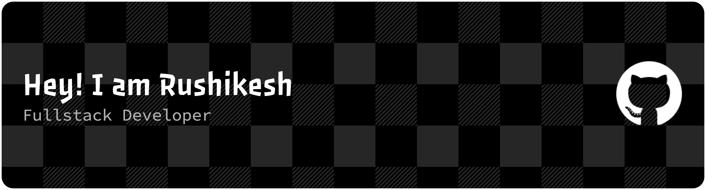

#  About Me:
I am a Computer Engineering student at Goa College of Engineering and a passionate Full Stack Developer specializing in the MERN stack. I enjoy building intuitive and high-performance web applications that solve real-world problems.  Through internships and personal projects—like developing social media apps and community websites—I have gained hands-on experience with technologies including React, Next.js, Node.js, and various databases like MongoDB, Convex, and Turso. I have also worked with modern tools like GSAP for animations and Clerk for authentication.  Currently, I am expanding my skills into the exciting field of Artificial Intelligence and Machine Learning, aiming to combine my web development background with data-driven insights to build more intelligent and impactful software.

## 🌐 Socials:
   

# 💻 Tech Stack:
                                             
# 📊 GitHub Stats:
 
 

## 🏆 GitHub Trophies

### ✍️ Random Dev Quote

---

<!--  -->
